# 2022-2-EuPescadorDoc

## Sobre

Este repositório tem o propósito de armazenar a documentação do projeto Eu Pescador, gerenciado pelo time 3 das disciplinas de Engenharia de Produto de Software ( EPS ) e Métodos de Desenvolvimento de Software ( MDS ) da Faculdade do Gama no período 2022/2.

## Equipe

|Foto | Disciplina | Nome | GitHub | E-mail|
|:--:|:--:|:--:|:--:|:--:|
| 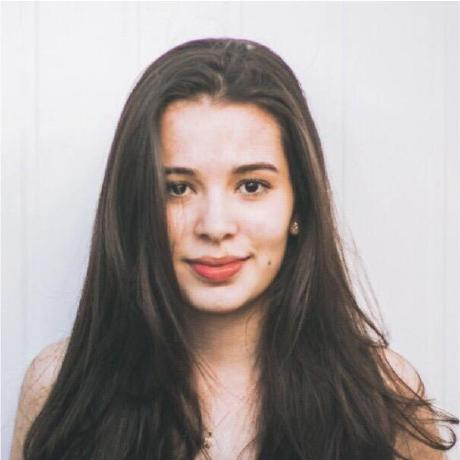 | EPS | Eduarda Servídio | [ServidioEC](https://github.com/ServidioEC) | dudaservidio@gmail.com |
| 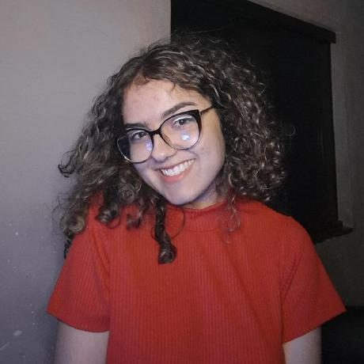 | EPS | Emily Dias | [emysdias](https://github.com/emysdias)| diassousa@yahoo.com.br |
| 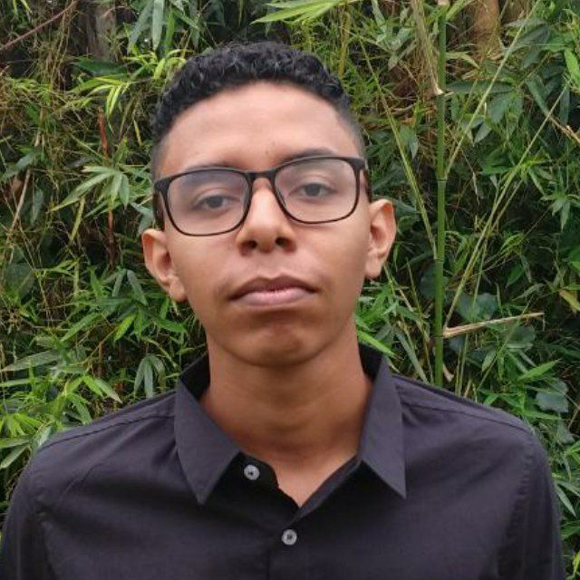 | MDS | Gabriel Ferreira | [oo7gabriel](https://github.com/oo7gabriel) |gabrielfsacademico@gmail.com|
| 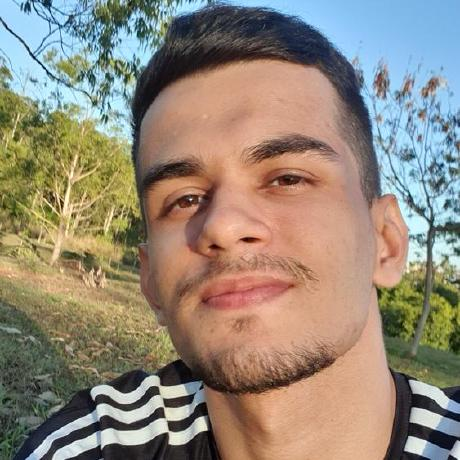 | MDS | Gustavo Barbosa| [brbsg](https://github.com/brbsg)| gustavobarbosa7162@gmail.com |
| 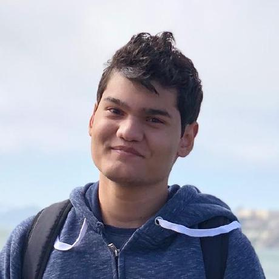 | EPS | Joao Gabriel  | [flyerjohn](https://github.com/flyerjohn)| jg.antunes.medeiros@gmail.com |
| 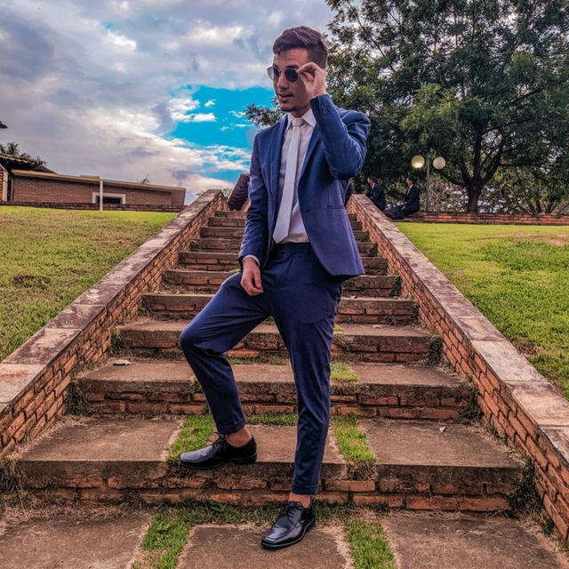 | MDS | Juan Jose  | | eng.juancerqueira@gmail.com |
| 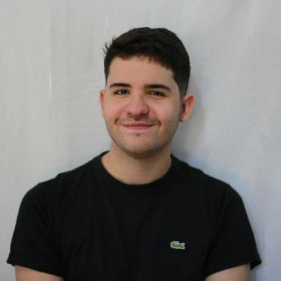 | MDS | Lucas Rodrigues | [lucascard](https://github.com/lucascard) | cardosolucasrodrigues@gmail.com |
| 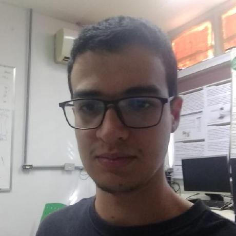 | MDS | Marcelo Victor| [marcelog5](https://github.com/marcelog5)| marcelovictorg2@gmail.com |
| 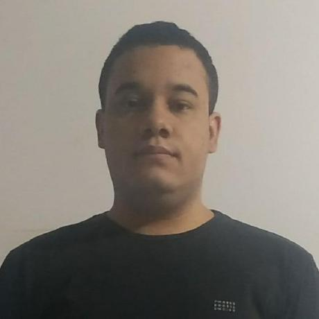 | EPS | Thiago Guilherme | [ThiagoGMF](https://github.com/ThiagoGMF) | 180028308@aluno.unb.br |
| 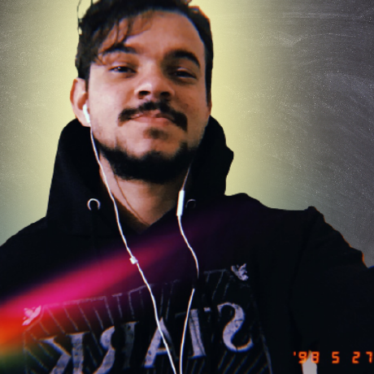 | MDS | Wallyson Andre  | [wallyson97](https://github.com/wallyson97)| wallysonandre22@gmail.com |
| 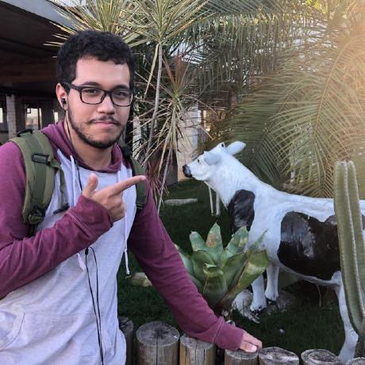 | EPS | Washington Bispo | [WashingtonBispo](https://github.com/WashingtonBispo) | juniorbispo515@gmail.com |
|  | MDS | Weslley Alves | [weslley17w](https://github.com/weslley17w) | weslley17w@gmail.com |