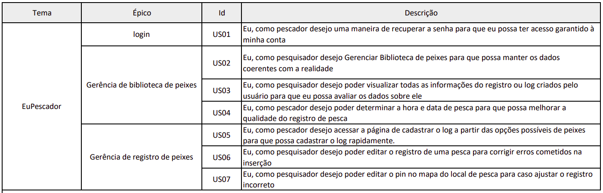

# Backlog do Produto 

Em termos gerais, o Product BackLog é uma listagem de todos os afazeres pendentes no projeto. Ele substitui o modelo tradicional de especificação de artefatos. Cada elemento da listagem é elicitado por meio de interação da equipe de desenvolvimento com o Cliente - podendo ser apenas um representante, o que torna os elementos levantados muito arbitrários; ou podendo ser uma equipe representante do Cliente, representando as diversas áreas que utilizarão o produto.

## Histórias de Usuário

Uma história do usuário é uma explicação informal sobre uma determinada funcionalidade ou recurso de um software do ponto de vista de um usuário. Seu objetivo é facilitar o entendimento de como o recurso gera valor ao usuário.

## Referências

> RADIGAN, Dan. O backlog do produto: sua lista de tarefas definitiva. Disponível em [Link](https://www.atlassian.com/br/agile/scrum/backlogs). Acesso em: 29 nov. 2022.

> REHKOPF, Max. Histórias de usuários com exemplos e um template. Disponível em [Link](https://www.atlassian.com/br/agile/project-management/user-stories). Acesso em: 29 nov. 2022.

> Backlog. Disponível em: [Backlog 2022.1](https://fga-eps-mds.github.io/2022-1-EuPescador-Doc/docs/produto/documento-arquitetura/). Acesso em: 10 dez. 2022.

## Versionamento

|    Data    | Versão |      Descrição       |                                                               Autor                                                               |
| :--------: | :----: | :------------------: | :-------------------------------------------------------------------------------------------------------------------------------: |
| 29/11/2022 |  1.0   | Criação do documento | [Emily Dias](https://github.com/emysdias), [Eduarda](https://github.com/ServidioEC),
[Marcelo](https://github.com/marcelog5), [Thiago](https://github.com/thiagogmf), [Gabriel](https://github.com/oo7gabriel), [Washington](https://github.com/WashingtonBispo), [João Gabriel](https://github.com/flyerjohn) |
| 1/12/2022 |  1.1   | Atualização do documento | [Eduarda](https://github.com/ServidioEC),
[Marcelo](https://github.com/marcelog5), [Gabriel](https://github.com/oo7gabriel), [João Gabriel](https://github.com/flyerjohn) |
| 10/12/2022 | 1.2 | Ajustes do documento | [Emily Dias](https://github.com/emysdias) |
